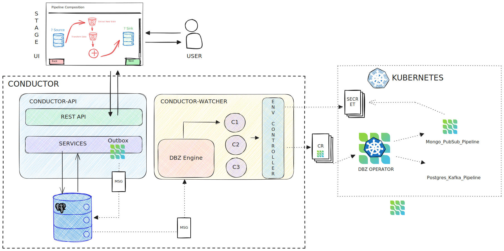

This repository has been archived infavour of [debezium-platform](https://github.com/debezium/debezium-platform)


# debezium-platform-conductor

The back-end component of Debezium management platform. Conductor provides a set APIs which can be 
used to orchestrate and control Debezium deployments. Usually it's intended to be interacted with through a front-end client.

**Disclaimer**: This project is still in early development stage and should not be used in production.

## Debezium Management Platform
Debezium Management Platform (Debezium Orchestra) aims to provide means to simplify the deployment of 
Debezium to various environments in highly opinionated manner. The goal is not to provide 
total control over environment specific configuration. To achieve this goal the platform uses
a data-centric view on Debezium components.


## Platform Architecture
The platform is composed of two main components:

1. Conductor: The back-end component which provides a set of APIs to orchestrate and control Debezium deployments.
2. Stage: The front-end component which provides a user interface to interact with the Conductor.


### Conductor Architecture
The conductor component itself is composed of several subcomponents:

1. API Server: The main entry point for the platform. It provides a set of APIs to interact with the platform.
2. Watcher: Component responsible for the actual communication with deployment environment (e.g. Debezium Operator in K8s cluster). 




## How to Try the Platform
There are currently two examples available to try the platform under `examples` directory:

1. `compose-rest-api-only`: This example provides a mean to run the API server and the front-end Stage application locally. While data is persisted in a local database, the platform does not interact with any deployment environment (which means no Debezium pipelines are actually deployed).
2. `compose-kind-kafka`: This example uses a more complex environment which relies on local Kubernetes cluster provision via [Kind](https://kind.sigs.k8s.io/)

### Running the `compose-rest-api-only` Example
To run the example, execute the following command from the `examples/compose-rest-api-only` directory:

```shell
# Using podman
podman compose -f compose.yml up

# Using docker 
docker compose -f compose.yml up
```

### Running the `compose-kind-kafka` Example
To run the example, execute the following commands from the `examples/compose-kind-kafka` directory:

```shell
# Create the local Kubernetes cluster
./create-cluster.sh

# Deploy the platform (podman)
docker compose -f compose.yml up

# Deploy the platform (docker)
docker compose -f compose.yml up
```

The `create-cluster.sh` performs several steps:

1. Creates a local Kubernetes cluster using Kind.
2. Exports "internal" `kubeconfig` file, which is then mounted to the conductor container.
3. Deploys Debezium Operator to the cluster.
4. Deploys Strimzi Operator to the cluster.
5. Provisions PostgreSQL database and Kafka Cluster in the cluster.

The behaviour of `create-cluster.sh` can be modified by changing the values in the `env.sh` file.


